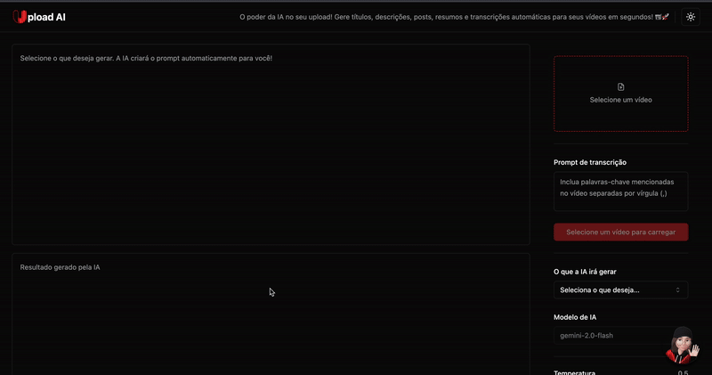

<h1 align="center"><strong>Upload AI 📹🚀</strong></h1>

Criar vídeos de qualidade já é um trabalho árduo. Depois vem a luta para:

* Escrever títulos chamativos.
* Criar descrições atraentes.
* Pensar em posts virais.
* Condensar um resumo do conteúdo do vídeo.

**UploadAI** veio para automatizar todas essas tarefas repetitivas!

<a href="https://github.com/alinebuchino/uploadAI/raw/main/UploadAI.mp4" target="_blank">
  👉 Clique aqui para ver o vídeo de demonstração
</a></br>




---

## ✨ Resumo de suas principais funcionalidades:

**Com base no conteúdo do seu vídeo, o UploadAI é capaz de:**

*   **Gerar Títulos:** Geração de títulos incríveis e irresistível.
*   **Gerar Descrisções:** Geração de uma descrição sucinta e envolvente.
*   **Criar Postar:** Criação de posts para diversas plataformas de forma atraente, focado em engajamentos.
*   **Criar Resumos:** Criação de resumos com comunicação clara e de forma sucinta.

**E não para por aí, o UploadAI também oferece:**

*   **Nina - Assistente Virtual:** ChatBot desenvolvido com o intuito de solucionar dúvidas, guiar e ajudar a extrair o máximo do UploadAI.
*   **Controle de Temperatura da IA:** Opção para definir o quão criativa e precisa você quer que a IA seja.

---

##  ⁉️ Quem deve usar o Upload AI?

*   **YouTubers e Criadores de Conteúdo:** Ganhe tempo, aumente o alcance e o engajamento.
*   **Profissionais de Marketing:** Otimizem vídeos para campanhas, melhore o SEO e crie conteúdo social com facilidade.
*   **Educadores e Instrutores:** Adicione legendas, transcrições e divulgue aulas com posts gerados por IA.
*   **Qualquer pessoa que trabalhe com vídeo** e queira um superpoder de IA ao seu lado!

---

##  👩🏻‍💻 Tecnologias utilizadas:

*   **Frontend:** React, TypeScript, Tailwind CSS, Shadcn/ui, Axios, Lucide React
*   **Backend:** Node.js, Fastify, Prisma, TypeScript, Zod
*   **Inteligência Artificial:** Google Gemini API (para geração de texto, criação de posts e o chatbot Nina)
*   **Processamento de Vídeo/Áudio:** FFmpeg (para extração de áudio)

---

## 🚀 Comece Agora!

1.  **Clone o Repositório:**
    ```bash
    git clone https://github.com/alinebuchino/uploadAI.git
    cd upload-ai
    code .
    ```
2.  **Configure o Ambiente:**
    *   No arquivo .env, defina sua GEMINI_API_KEY
3.  **Rode a Aplicação:**
    *   Digite: npm install (para obter todas as dependências do projeto)
    *   Dentro de upload-ai-server digite: npm run dev
    *   Dentro de upload-ai-web digite: npm run dev

---

**Deixe a inteligência do Upload AI lidar com as tarefas maçantes. Aproveite!** 🌟